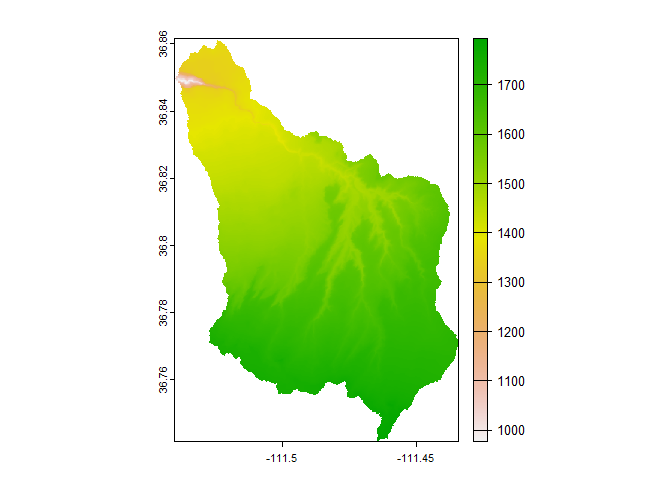
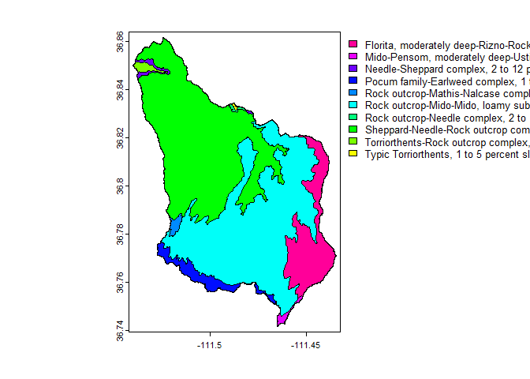

<!-- README.md is generated from README.Rmd. Please edit that file -->

# desertHydro

<!-- badges: start -->

[](https://github.com/maxwell-miller-geo/desertHydro/actions/workflows/R-CMD-check.yaml)
<!-- badges: end -->

The goal of desertHydro is to create a spatially distributed
hydrological model built with R tools! Many spatially distributed
hydrological tools exist, but the purpose of this one is to provide the
space for those familiar with R to build and create their own models.
The integration of many outstanding packages within the R community
makes this possible. This package serves to utilize free and/or readily
available hydrological data to improve the hydrological understanding of
these arid regions.

# Abstract

Quantifying hydrologic response of arid region watersheds to convective
storms is poorly constrained and needs to be addressed with implications
for agriculture, land management, and hazard assessment. Modeling of
arid and semi-arid watershed hydrology presents many challenges,
including dynamic infiltration, widely distributed storm cells both
spatially and temporally, and steep slopes. Novel techniques and
remotely sensed data are necessary to model arid watersheds.

The example below is the Waterhole’s watershed located in northern
Arizona and is representative of the challenges that face arid
watersheds. This package seeks to create a physically based, spatially
distributed hydrology model to evaluate watershed hydrology under
different land cover and climate scenarios in arid regions. The flow
model desertHydro is built using R software and CRAN packages with
widely used packages such as whitebox and terra. The desertHydro package
facilitates the creation and modification hydrological simulations with
GIS applications. The paper compares the effects that different rainfall
inputs have on the discharge within the watershed. The purpose of this
model is to create spatially distributed rainfall-runoff results for a
watershed with repeatable results. Future improvements to surface water
flow calculations and infiltration will increase the effectiveness of
the model.

## Installation

You can install the development version of desertHydro from
[GitHub](https://github.com/) with:

``` r
# install.packages("devtools")
devtools::install_github("maxwell-miller-geo/desertHydro")
```

## Expected Workflow

``` r
library(desertHydro)
library(terra)
#> terra 1.7.71
# library(whitebox)
```

The set-up for desertHydro is to separate the whole process into two
folders.

### 1 Watershed Elements

``` r
# Using the example directory within the package
WatershedElements <- 
  dirname(system.file("extdata", "dem.tif", package = "desertHydro")) 
```

Some elements present within the demo within the package.

``` r
list.files(WatershedElements)
#>  [1] "boundary.cpg"                        "boundary.dbf"                       
#>  [3] "boundary.prj"                        "boundary.qmd"                       
#>  [5] "boundary.shp"                        "boundary.shx"                       
#>  [7] "breach-test.tif"                     "dem.tif"                            
#>  [9] "dem.tif.aux.xml"                     "example_discharge.csv"              
#> [11] "geo_adjustments.xlsx"                "geo_soils.cpg"                      
#> [13] "geo_soils.dbf"                       "geo_soils.prj"                      
#> [15] "geo_soils.shp"                       "geo_soils.shx"                      
#> [17] "LandCoverCharacteristics_Soils.xlsx" "main-stem.dbf"                      
#> [19] "main-stem.shp"                       "main_stem.tif"                      
#> [21] "mini_ws.cpg"                         "mini_ws.dbf"                        
#> [23] "mini_ws.prj"                         "mini_ws.shp"                        
#> [25] "mini_ws.shx"                         "mod_dem.tif"                        
#> [27] "model_landcover.tif.aux.xml"         "observable-discharge.csv"           
#> [29] "rain-data-day-2022.csv"              "smooth_dem.tif"                     
#> [31] "soils.cpg"                           "soils.dbf"                          
#> [33] "soils.prj"                           "soils.shp"                          
#> [35] "soils.shx"                           "stream_analysis.dbf"                
#> [37] "stream_analysis.prj"                 "stream_analysis.shp"                
#> [39] "stream_analysis.shx"                 "stream_path.cpg"                    
#> [41] "stream_path.dbf"                     "stream_path.prj"                    
#> [43] "stream_path.qmd"                     "stream_path.shp"                    
#> [45] "stream_path.shx"                     "test-boundary.cpg"                  
#> [47] "test-boundary.dbf"                   "test-boundary.prj"                  
#> [49] "test-boundary.qmd"                   "test-boundary.shp"                  
#> [51] "test-boundary.shx"                   "USGS_Rain_2001_2021.xlsx"           
#> [53] "USGS_Rain_2022.xlsx"                 "voronoi.cpg"                        
#> [55] "voronoi.dbf"                         "voronoi.prj"                        
#> [57] "voronoi.shp"                         "voronoi.shx"                        
#> [59] "waterholes_extent.tif"               "waterholes_shape.dbf"               
#> [61] "waterholes_shape.prj"                "waterholes_shape.shp"               
#> [63] "waterholes_shape.shx"                "watershed_stack.tif.aux.xml"
```

The watershed elements folder will contain all of the necessary
information about a given watershed.

For example,

``` r
# Examples for models
demFile <- "dem.tif" # name of digital elevation model
dem <- terra::rast(file.path(WatershedElements, demFile))
terra::plot(dem)
```

 Other
types of data, Soil from [Web Soil
Survey](https://websoilsurvey.nrcs.usda.gov/app/ "Soil App")

``` r
soils <- terra::vect(file.path(WatershedElements, "soils.shp"))
terra::plot(soils, "muname")
```



Handling rainfall data

``` r
rainfall <- file.path(WatershedElements, "USGS_Rain_2022.xlsx")
gauges_list <- readxl::read_xlsx(rainfall) # contains multiple spreadsheets
tail(gauges_list)
#> # A tibble: 6 × 4
#>   Gage    Longitude Latitude `Start date`
#>   <chr>       <dbl>    <dbl>        <dbl>
#> 1 TAN-G       -112.     36.7           NA
#> 2 TATER-1     -112.     36.5           NA
#> 3 TATER-2     -112.     36.5           NA
#> 4 WATER-1     -111.     36.8           NA
#> 5 WATER-2     -111.     36.8           NA
#> 6 WATER-G     -112.     36.8           NA
```

Filter rainfall

``` r
# Rainfall file - "USGS_Rain_2022.xlsx" is stored in Watershed Elements
# Select days of rainfall for spreadsheet with year "2022"
rain <- suppressWarnings(
  desertHydro::rainfallTotalRain(WatershedElements,
                                 date = "2022", 
                                level = "day")
)
# Suppress warnings to ignore dirty data
tail(rain)
#>      Time_day WATER-1 WATER-2 WATER-G Total_in
#> 80 2022-06-17       0       0    0.04     0.04
#> 81 2022-06-18       0       0    0.06     0.06
#> 82 2022-06-19       0       0    0.02     0.02
#> 83 2022-06-26       0       0    0.02     0.02
#> 84 2022-07-11       0       0    0.01     0.01
#> 85 2022-07-23       0       0    0.05     0.05
```
